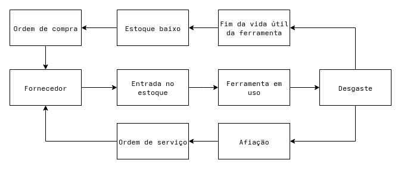
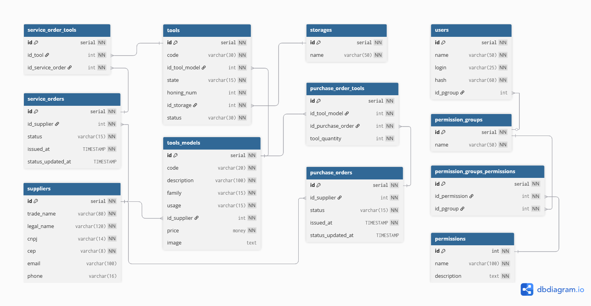

# Proposta de projeto

Sistema de gerenciamento de estoque para ferramentas de usinagem.

## Objetivo

Facilitar a visualização e o controle das ferramentas, evitando perdas e itens em falta.

## Funcionalidades

- Visualização geral do estoque.
- Rastrear movimentações.
- Separação do estoque em setores: em uso, enviada para afiação, armazenada.
- Cadastro de ferramentas como brocas, fresnas, alargadores, insertos, etc...
- Cadastro de fornecedores.
- Emissão de ordens de compra e ordens de serviço.
- Notificação de estoque baixo.
- Relatórios de consumo e despesas.

## Diagrama de fluxo

## Diagrama ER

### users

Usuários do sistema

### permissions

Permissões do sistema

### permissions_users

Tabela relacional para garantir permissões à usuários

### storages

Estoques da empresa. Ex: Estoque central / Estoque preset

- **name**: Nome do estoque

### suppliers

Fornecedores

- **name**: Nome do fornecedor
- **cnpj**: CNPJ do fornecedor
- **cep**: CEP do fornecedor

### tools_models

Representa os modelos de ferramentas

- **code**: Código que identifica o modelo da ferramenta internamente. Ex: 092857
- **description**: Descrição usada para identificar a ferramenta com fornecedores. Ex: BROCA MD DIAM20
- **family**: Família da ferramenta. Ex: Broca / Alargador / Fresna
- **usage**: Tipo de uso da ferramenta. Ex: Consumível / Reafiável
- **id_supplier**: Fornecedor
- **price**: Preço da ferramenta
- **image**: Caminho para imagem da ferramenta

### tools

Enquanto *tools_models* representa os diferentes modelos de ferramentas, *tools* representa uma ferramenta específica, incluindo informações sobre o uso da ferramenta, como quantas afiações ja foram feitas, em que estoque está localizada e qual o lote.

- **id_tool_model**: O modelo da ferramenta
- **state**: Se a ferramenta está nova ou ja foi afiada
- **batch**: Qual o lote da ferramenta
- **honing_num**: Número de afiações ja realizadas
- **id_storage**: Em qual estoque está localizad

### purchase_orders

Ordens de compra

- **id_supplier**: Fornecedor
- **status**: Status do pedido

### purchase_order_tools

Tabela relacional entre a ordem de compra e os modelos de ferramentas

- **id_tool_model**: Modelo de ferramenta
- **id_purchase_order**: Ordem de compra
- **tool_quantity**: Quantidade de ferramentas 

### service_orders

Ordens de serviço (Afiação de ferramentas)

- **id_supplier**: Fornecedor
- **status**: Status do pedido

### service_order_tools

Tabela relacional entre a ordem de serviço e as unidades de ferramentas 

- **id_tool**: Ferramenta
- **id_service_order**: Ordem de serviço

## Sistemas no mercado

- [Spinwiser](https://spinwiser.com.br/?lang=pt-br)
- [CONT.TOOL](https://conttool.com)
- [MATRIX Manage](https://www.ctms-imc.com/manage/)
