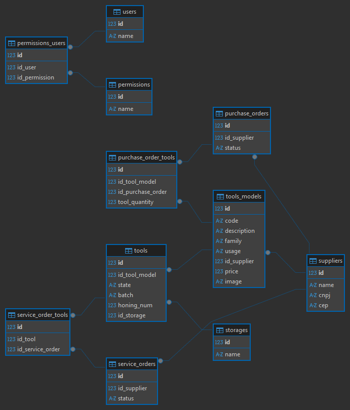

# Proposta de projeto

Sistema de gerenciamento de estoque para ferramentas de usinagem.

## Objetivo

Facilitar a visualização e o controle das ferramentas, evitando perdas e itens em falta.

## Funcionalidades

- Visualização geral do estoque.
- Rastrear movimentações.
- Separação do estoque em setores: em uso, enviada para afiação, armazenada.
- Cadastro de ferramentas como brocas, fresnas, alargadores, insertos, etc...
- Cadastro de fornecedores.
- Emissão de ordens de compra e ordens de serviço.
- Notificação de estoque baixo.
- Relatórios de consumo e despesas.

## Diagrama de fluxo

## Diagrama ER

## Sistemas no mercado

- [Spinwiser](https://spinwiser.com.br/?lang=pt-br)
- [CONT.TOOL](https://conttool.com)
- [MATRIX Manage](https://www.ctms-imc.com/manage/)
